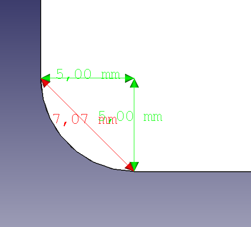
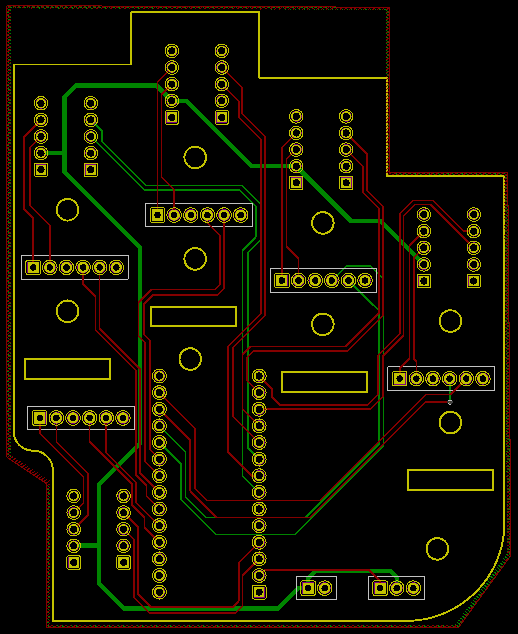

# PRINTED CIRCUIT BOARD FOR DEXTRA TPMG90-2
## OBJECTIVE 
The main objective is to design a Printed Circuit Board (PCB) to replace the breadboard, shown bellow, in the back of the right robotic hand of the humanoid robot TEO. A PCB is a board or card that electrically connects and mechanically supports electrical components. These connections are made with a series of conductive tracks or traces (usually copper ones). This copper is laminated onto or in between sheets of non-conductive material like fiberglass.

## CONSIDERATIONS

Points below were taken into account during the design process:
* PCB shape and size
* User interfaces
* PCB layers
* Ground layers
* Traces width

Regarding PCB traces:
* 45° angles shorten the electrical path between components.
* High speed logic signals (above 200 MHz) can get reflected off the back of the angle, Causing interference.
* 90o has the likelihood of being etched narrower than your standard trace width.
* 90o traces back might not be fully etched, could cause shorts.

## MATERIALS

The design of the PCB is going to be done using KiCad, an open-source software tool which can be considered mature enough to be used for the successful development and maintenance of complex electronics boards.

## WORKFLOW

The KiCad workflow is comprised of two main tasks: drawing the schematic and laying out the board. Both a schematic component library and a PCB footprint library are necessary for these two tasks. In the following figure, the workflow followed during this project is shown.

Any PCB design is divided in three main steps:
* Schematics design
* PCB design (routing, components and PCB dimensions)
* BOM list (Bill of materials): actual components to be used (in case connectors of any type have to be considered: USB, expansion jumper connectors...)

### 1. SCHEMATIC DESIGN

It is assumed that each components is a box with inputs and outputs. The schematic contains the connections between the pins of the boxes without considering the dimensions of any component. To start with the design it is needed the datasheet with the pinout description for each component (in our case the drivers, the Servo and the microprocessor).

* DRV8838 Single Brushed DC Motor Driver Carrier

* Microcontroller: Teensy 3.2

* Servo TowerPro MG90 (directly connected to the PCB)

The starting point of this project is based on the connections shown in the schematic depicted in the figure bellow, and available in this GitHub repository (Dextra/Schematics/DEXTRA_TPMG90-2.png). In this design each component is represented as a pair of standard connectors (one for each side of the component). Although it can be easily understood, it is preferable to create specific symbols for each component to facilitate PCB layout in following steps.

The symbols for the components are stored in two different schematic libraries located in “Project folder/Libraries/dorsalSchematic_Components/ and are named: <b>DRV8838_Pololu.lib</b> and <b>teensy.lib</b>. In the case of the driver, the components were created manually using KiCad and in the case of the Teensy it was downloaded from a GitHub [repository](https://github.com/XenGi/teensy_library). The pair of figures bellow show the schematic symbols for Teensy 3.2 and Pololu Driver, respectively.

The final schematic is shown bellow. Standard connectors have been used for the 6 encoders, the Servo and the battery input. For the drivers and the Teensy the symbols already mentioned are shown. In order to establish the connections global labels, no connection flags, and power ports have been used. Final step is <b>to annotate the components and create the Netlist</b> which is later import in the PCB design.

### 2. PCB DESIGN

This is probably the most difficult part of the project.. Steps followed are:

1. Assign footprints to each symbol in the schematic design.
2. Import Netlist with the connections
3. PCB layout design:
    1. Draw PCB edges and holes according to CAD specifications.
    2. Place each component in specific locations and orientations to facilitate trace routing
    3. Route components: use front and back Cu layers because there are too many connections; use vias when needed; increase trace width depending on maximum current specifications.
    4. Fill Front and Back Cu layers with GND and VCC (+3.3V), respectively.
4. Define Design Rules according to Oshpark prototypes and run Design Rules Check at the end of the layout to avoid errors.
5. Place text and Logos to indicate component name and orientation during assembly.

The main difference between footprints and symbols is that footprints define the physical interface between the PCB and the component (land pattern) and include other information (outline, polarization mark, reference...) while symbols are just a representation of the component (they abstract its function) showing the pins.

In order to assign each correspondent footprint to the symbols, a new library of footprints has been created with the corresponding footprints for the drivers and the Teensy. In the folder “Project folder */Libraries/dorsalPCB_Components.pretty* / (folders ending in .pretty are recognized by KiCad as footprint library) are 3 footprints. The footprint for the driver has been
created manually using the dimension specification in its datasheet (shown below).

The footprint for the Teensy has been downloaded for the GitHub [repository](https://github.com/XenGi/teensy.pretty) and edited in KiCad to delete the pins which are not used in the design. Only pins on sides have been kept, as shown in the figures below, to facilitate routing.

Once the footprints have been assigned it is possible to read the schematic Netlist and start designing the PCB. Steps follow for the design are explained below:

* Place the components into the space of the designed board. For this step, the CAD file of the dorsal is used (path:  Dextra/Dextra_TPMG90-2_CAD_files/dorsalTPMG90-2.FCStd). The dimensions are specified in the figures below.

The shape and distribution have been drawn in the edge cap layer (See Annex) using graphic lines and circles (and using different grids to draw an accurate design). (Defining the outline)

The next step is drawing traces to make air wires disappear (checking always the design rules check DRC). If there are any issues with the layout (such as traces being too close together) it will appear there, as well as the connections which should be made with copper traces. Traces have been drawn in front cupper layer and back cupper layer, using only 45 degree bends to make connections. Considerations:

* Power lines /Power traces (VBat in our case) are larger than signal traces as they need to carry much more current. Theoretically the trace supplying power needs to support up to 1.7 A, according to Pololu DRV8838 datasheet. Trace width calculator (0.676 mm). 
* Connect first pads which are close together.
* Traces have not been used to connect the Ground and VCC (+3.3V) nodes as a Cu pour will be used to make those connections. A copper pour is an area in the PCB that is filled with copper. The pour is usually connected to DC voltage (Back Cu layer in our design) and Ground (Front Cu layer in our design). Its use reduces radio emissions from traces
that are surrounded by this pour especially in circuits with higher frequencies.
* It is not possible to draw a trace across another trace or a pad, use Vias in these situations.
* Use 45º angles (many older board houses could only manufacture straight lines on that angles). Also, when you get up to higher frequencies (above 1GHz) reflections could be introduced with hard 90º bends (not our case).
* Try to avoid acute angles where copper connects (older board manufacturing processes used harsh chemicals to etch away copper). Traces with bends of less than 90º would capture some of these chemicals (acid trap).

In the current design two pour areas have been used: one for the power (+3V3) in the back layer and the ground in the front layer. Also, connections between pads in both layers and one vias. The final result is shown in the next figure.

## Annex: Layers information

In KiCad the following layers are available.

* Layers that have a front and back version start with F. (for front) and B. (for back)
* The F.Cu and B.Cu layers are the copper layers
    * If there are additional copper layers they use the names In [number].Cu by default
    * The names for copper layers can be changed by the designer.
* F.Silk and B.Silk define artwork on the silkscreen layers.
    * Typically this is the white artwork printed on the board.
* F.Mask and B.Mask define the area free of [soldermask](https://en.wikipedia.org/wiki/Solder_mask) 193.
    * It is the negative of the resulting film that covers the board.
* F.Paste and B.Paste define the area that will be covered with [solder paste](https://en.wikipedia.org/wiki/Solder_paste) 88 (In datasheets often called stencil)
    * Used for [reflow soldering](https://en.wikipedia.org/wiki/Reflow_soldering) 32 of surface mounted devices.
* Edge.cuts: This layer is used to communicate with the manufacturer what the final board shape should look like.
    * The edge-cut is must not contain self intersections
    * Polygons on the edge-cut must be continuous and closed.
    * It is allowed to have internal cutouts
* F.Adhes and B.Adhes are layers to define adhesive (=glue) areas.
    * Only needed if components are on the bottom side during reflow soldering. (And even with components on the bottom it is not always needed. Check with your manufacturer if you need to define it for your board.)
* F.CrtYd and B.CrtYd are used to define a courtyard area.
    * The courtyard defines where no other component should be placed.
        * The size of this area depends on your manufacturing capabilities.
        * It also depends on your needs. (If you want the possibility to rework the pcb, you might need a larger area compared to when you do not plan to do this.)
        * The rules used in the official lib are defined in the [KLC - Rule](http://kicad-pcb.org/libraries/klc/F5.3/) F5.3 87 and are closely aligned to industry standards.
    * In KiCad 4.0.x courtyard violations are not checked by the design rule check
* F.Fab and B.Fab are documentation layers.
    * These are intended to be used for communicating with board assembly houses and for user documentation.
* Dwgs.User and Cmts.User are used for user drawings and comments.
    * In the official lib this layer is used to communicate with the user of footprints. (Example to tell them where to place keepout areas as they are not directly supported by KiCad in footprints)
* Eco1 and Eco2 are layers with no specific defined purpose. (The user can use them for whatever they want. They are not used in footprints supplied by the official lib.)
* Margin layer: Is there to define a margin relative to the edge cut.
    * There is no DRC check to verify that no copper feature violates the margin definition.
