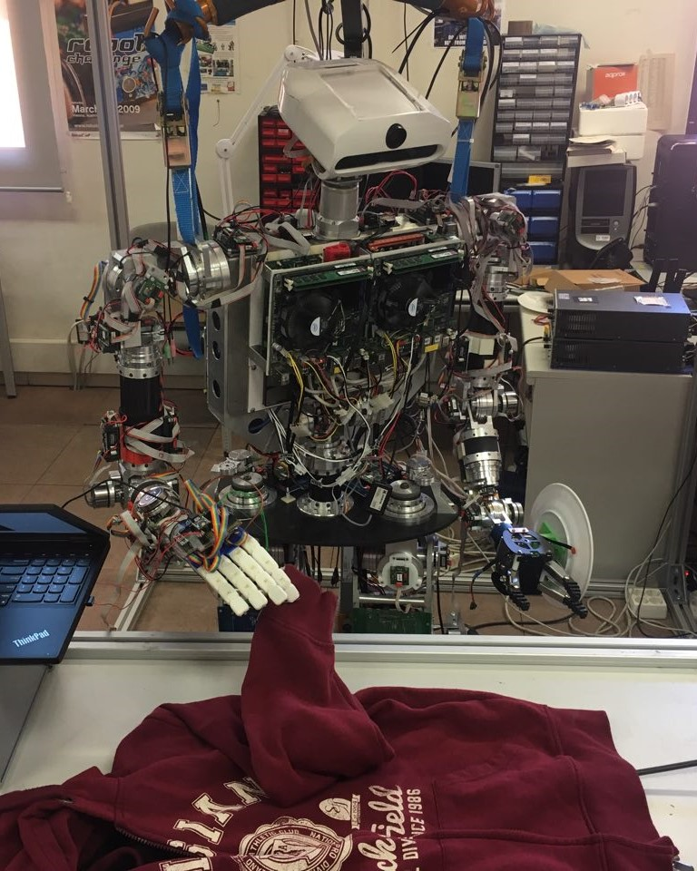
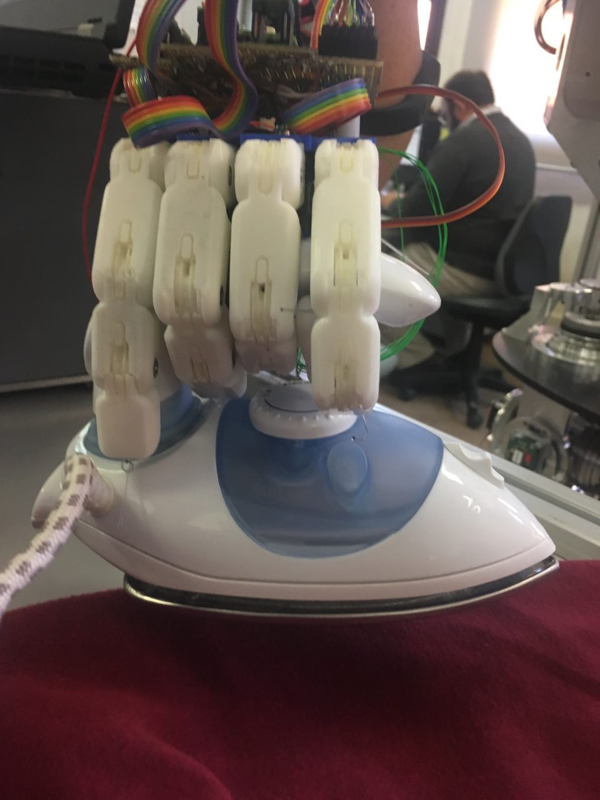
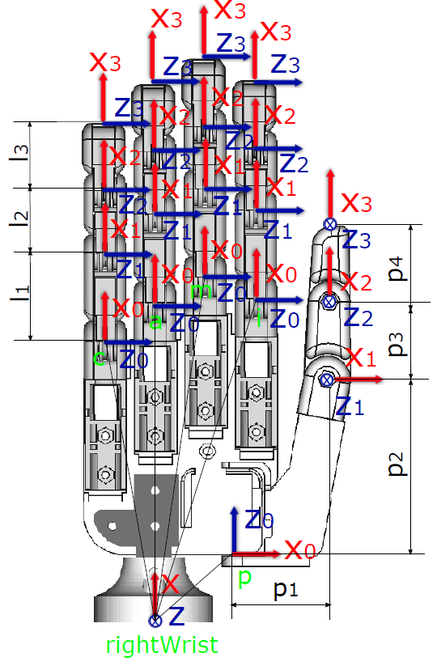

# Dextra Original (by Á. Villoslada)
Dextra is a printable robotic hand with the size of a human hand. This project was initially started to build a replicable and low cost alternative to current robotic hand prostheses. However, I think this device has more potential uses, for example in robotics research (humanoid robotics, mobile platforms with manipulation capabilities) or in education, fields that could benefit from the existence of a cheap and easy to repair robotic hand, a robotic device that is replicable and hackable, and simple but functional.

There is more information about Dextra on its [hackaday.io project page](https://hackaday.io/project/9890-dextra).

# Dextra TPMG90 (by J. Gago)

My Industrial Technologies Engineering Bachelor's Degree Final Project comprises the development and integration of an anthropomorphic robotic hand in the humanoid robot TEO. TEO is a household companion developed by RoboticsLab, at Carlos III University of Madrid, whose current robotic hands lack the necessary functionality for the tasks that require high manual dexterity, like fabric manipulation.

  

The scope of the proposed objectives is achieved through the development and study of several versions of the selected hand at the mechanical, electronic and software level. Multiple experiments are developed to evaluate the effectiveness of the robotic hand. In addition, the regulatory technical framework and the socio-economic environment of the project are evaluated, so that it complies satisfactorily with the established restrictions and adjusts to the current social and economic context.

The project is oriented to numerous additional studies around their behavior in the humanoid, contemplating the expansion of the TEO functions in relation to the versatility provided by his new fully functional hands. 

# Useful documents
The assembly instructions can be found [here](https://github.com/Alvipe/Dextra/tree/master/doc/dextra_assembly_instructions.pdf).

# Project index
* [Dextra_ORIGINAL_CAD_files](https://github.com/jgagom/Dextra/tree/dextraTPMG90/Dextra_ORIGINAL_CAD_files) - FreeCAD source files of the printable parts of Dextra Original
* [Dextra_TPMG90-1_CAD_files](https://github.com/jgagom/Dextra/tree/dextraTPMG90/Dextra_TPMG90-1_CAD_files) - FreeCAD source files of the printable parts of Dextra TPMG90-1
* [Dextra_TPMG90-2_CAD_files](https://github.com/jgagom/Dextra/tree/dextraTPMG90/Dextra_TPMG90-2_CAD_files) - FreeCAD source files of the printable parts of Dextra TPMG90-2
* [Schematics](https://github.com/jgagom/Dextra/tree/dextraTPMG90/Schematics) - Electronic schematics of Dextra Original, TPMG90-1 and TPMG90-2
* [TEO_Photos](https://github.com/jgagom/Dextra/tree/dextraTPMG90/TEO_Photos) - TEO & Dextra TPMG90-2 photos
* [Control](https://github.com/Alvipe/Dextra/tree/master/Control) - Code for different control methods (EMG, GUI)
* [Firmware](https://github.com/Alvipe/Dextra/tree/master/Firmware) - Main program and libraries that make Dextra move
* [doc](https://github.com/Alvipe/Dextra/tree/master/doc) - Documentation files

# License
  

Code is licensed under the [GPL v3 License](https://www.gnu.org/licenses/gpl-3.0.html). The rest of the work is licensed under the [Creative Commons Attribution-ShareAlike 4.0 International License](http://creativecommons.org/licenses/by-sa/4.0/).
